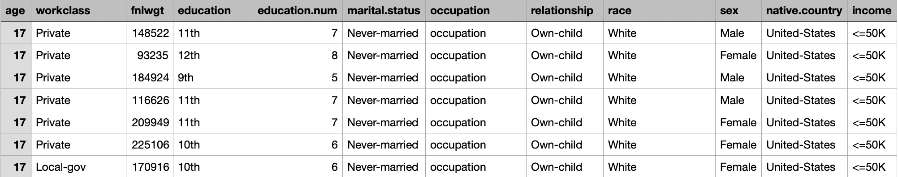
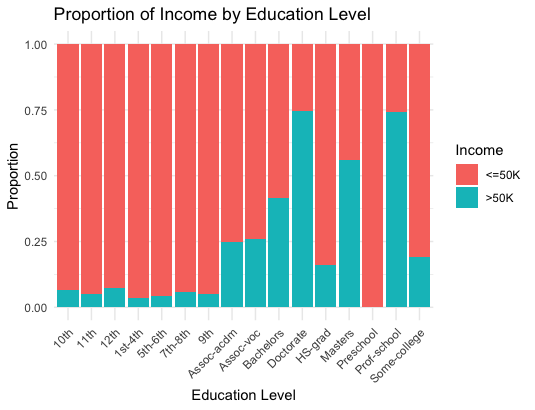
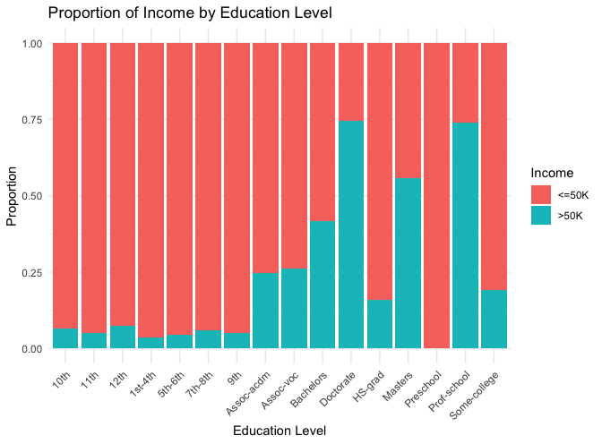

# Team Research and Development Project - Group A125

## Research Question:
**“Is there a difference in proportions of income across different levels of education among adults in the USA?”**

---

## Table of Contents
1. [Introduction](#introduction)
2. [Dataset](#dataset)
3. [Hypotheses](#hypotheses)
4. [Data Visualization](#data-visualization)
5. [Steps for Reproduction](#steps-for-reproduction)

---

## Introduction
This project investigates whether the distribution of income (`<=50K` vs. `>50K`) varies across education levels among adults in the United States. The goal is to test if educational attainment influences income distribution and to visualize the relationship.

---

## Dataset
- **Source**: [Dataset Link](#) *(https://www.kaggle.com/datasets/anaghakp/adult-income-census?resource=download)*
- The dataset includes 31,947 rows and 12 columns, with the key columns for this analysis being:
  - `education`: Levels of education attained.
  - `income`: Income categories (`<=50K` and `>50K`).

### Snapshot of the Dataset:
Below is a preview of the first five rows of the dataset:

---

## Hypotheses

- **Null Hypothesis (H₀)**: There is no difference in the proportions of income between/among the levels of education among adults in the USA.
- **Alternative Hypothesis (H₁)**: There is a difference in the proportions of income between/among the levels of education among adults in the USA.

---

## Data Visualization
### Stacked Bar Plot:
Below is a stacked bar plot showing the proportions of income (`<=50K` and `>50K`) across different levels of education:

<<<<<<< HEAD

=======

>>>>>>> refs/remotes/origin/main

Chi-squared method is used for analysing this data. Hence our Research Question is is about differences in proportions ,we will use chi-square test to check for the likelihood that there is a relationship between income and number of years of education.

---

## Steps for Reproduction
1. **Download the Dataset**:
   - Obtain the dataset from the provided link above.

2. **Analysis Script**:
   - Use the provided R script to wrangle the data, generate visualizations, and perform statistical testing. The R script includes:
     - Data filtering and summarization.
     - Generation of a stacked bar plot.
     - Chi-squared test to evaluate statistical significance.

3. **Interpret Results**:
   - Review the visualization and statistical outputs to determine if there is a significant difference in proportions.

---
